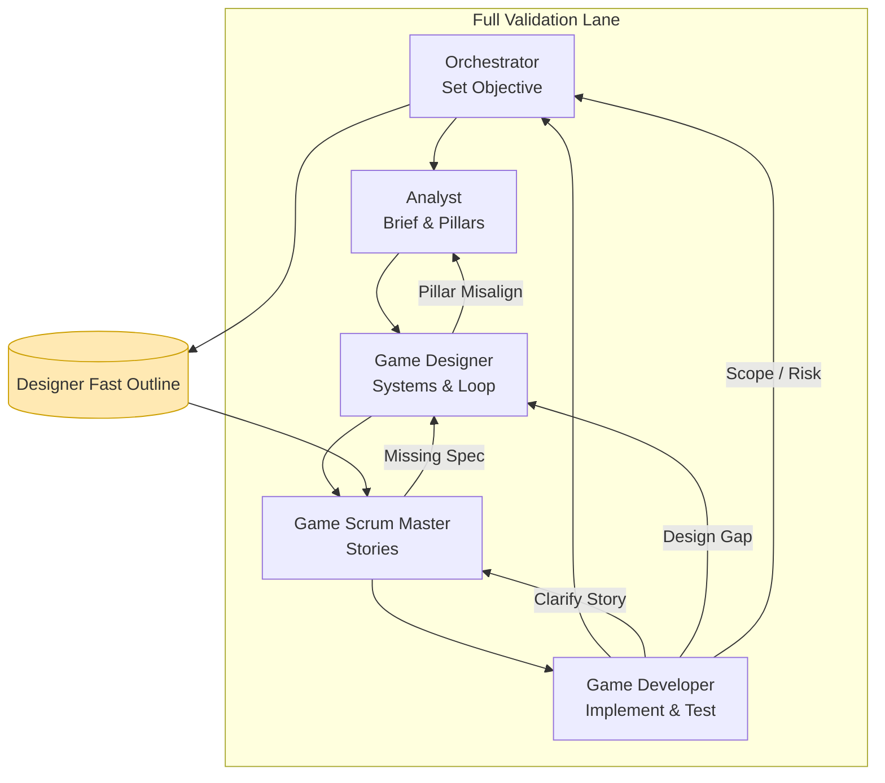

## เอกสารลำดับการใช้เอเจนต์ (Agent Usage Pipeline)

วัตถุประสงค์: ทำให้ทีมเข้าใจว่าแต่ละเอเจนต์ (persona) ต้องการข้อมูลตั้งต้นอะไร ผลิตอะไร ส่งมอบให้ใคร และนิยามความสำเร็จ (Definition of Done) คืออะไร เพื่อให้การไหลของงานคงเส้นคงวา ลดช่องว่างระหว่างดีไซน์กับการลงมือพัฒนา

> มี Project Brief แยกที่ `docs/analyst/project-brief.md` (รวม Executive Summary, ปัจจัย 4, ระบบการลงทุน, Pillars, Scope, KPI) — อัปเดตก่อนเริ่มสปรินต์ใหม่ทุกครั้ง

เอเจนต์ที่ใช้ในระบบ (จากไฟล์ `.github/chatmodes`):
- Orchestrator (`bmad-orchestrator`)
- Analyst (`analyst`)
- Game Designer (`game-designer`)
- Game Scrum Master (`game-sm`)
- Game Developer (`game-developer`)

---
## ภาพรวมลูปหลัก (Full Validation Lane)

1. Orchestrator → 2. Analyst → 3. Game Designer → 4. Game Scrum Master → 5. Game Developer → (ย้อนกลับ Orchestrator เพื่อเลือกงานถัดไป)

มี Fast Prototype Lane (เร่งพิสูจน์แนวคิด) ข้าม Analyst ได้ หรือบางครั้ง Designer สร้าง Skeleton แล้วให้ SM แตก Story สั้น ๆ ก่อน

---
## ตารางสรุป Input / Output / DoD

| Agent | ต้องมีให้พร้อม (Input) | กิจกรรมหลัก | ส่งมอบ (Deliverables) | ส่งต่อให้ | Definition of Done (DoD) |
|-------|-------------------------|-------------|------------------------|-----------|--------------------------|
| Orchestrator | เป้าหมายระดับ Iteration/Feature คร่าว ๆ หรือ Pain ปัจจุบัน | จัดลำดับเป้าหมาย, เลือก workflow, ตัดสินใจ lane (Full / Fast) | Objective Statement, Scope Note, Lane Choice | Analyst หรือ Designer (Fast Lane) | Objective มี KPI/Metric หรือ Hypothesis วัดค่าได้, ขอบเขตไม่เกิน Iteration ที่กำหนด |
| Analyst | Objective / Hypothesis จาก Orchestrator | สำรวจปัญหา, ผู้เล่นเป้าหมาย, Competitive scan เบื้องต้น, Brainstorm Pillars | Project Brief, Player Segment Summary, Core Pillars (3–5), Risks & Assumptions | Game Designer | มี Pillars ชัด, ระบุ Player Segment, ปัญหา ↔ แนวทางแก้, Risk สูงสุดมี Mitigation Note |
| Game Designer | Project Brief / Pillars (หรือ Objective ตรง ๆ ใน Fast Lane) | กำหนด Core Loop, Systems, Resource Flows, UX State/Phase Outline, Mechanics Spec | Game Design Doc (GDD Sections), Systems Spec, Mechanics Table, Loop Diagram (ข้อความ/ASCII) | Game Scrum Master | ทุกระบบมี Purpose, Inputs, Outputs, Failure/Edge Cases, Inter-system Interactions ระบุแล้ว, ไม่มี TBD สำคัญ |
| Game Scrum Master | GDD Sections / System Spec | แตกเป็น Game Stories (พร้อม Acceptance Criteria), จัดลำดับ, ตรวจ DoD Checklist | Game Stories (Markdown), Story Backlog (ordered), DoD Checklist Result | Game Developer | ทุก Story มี Context, Acceptance Criteria (Given/When/Then หรือ bullet ตรวจได้), ไม่มีคำกำกวม, Dependencies ชี้ชัด |
| Game Developer | Approved Stories + DoD Checklist ผ่าน | Implement, เขียน/อัปเดต Tests, Lint/Refactor, Performance sanity, อัปเดตสถานะ Story | Source Code, Passing Test Suite, Story Status Updated, Change Notes (ถ้ามี deviation) | Orchestrator (สรุปผล) | Tests ครอบ Acceptance Criteria, Lint + Type ผ่าน, ไม่มี console noise, Performance baseline ไม่ถดถอย, Story Status = Done |

---
## Fast Prototype Lane (เมื่อต้องพิสูจน์ Core Loop / Fun Factor เร็ว)

ลำดับ: Orchestrator → Game Designer (สั้น) → Game Scrum Master (1–2 Prototype Stories) → Game Developer → Orchestrator (ประเมินผล)  
ลดเอกสาร: ข้าม Project Brief, ใช้ Mini Design Outline (Core Loop + 1 Resource Flow + Success Criteria สั้น ๆ)  
เงื่อนไขกลับไป Full Lane: เมื่อ Prototype ผ่าน Benchmark (เช่น ผู้ทดสอบ 3 ใน 5 คนบอก “loop ยังอยากเล่นต่อ”) หรือเริ่มมีการขยายระบบเสี่ยงต่อ technical debt

Mini Design Outline ควรมี:
- Core Loop (ข้อความลำดับ 5–7 ขั้น)
- Goal Metric ชั่วคราว (เช่น Avg Session > 3 loops)
- Mechanics List (ชื่อ / บทบาท / ทรัพยากรที่แตะ)
- Open Questions (สูงสุด 5)

---
## Trigger & Feedback Loops (เมื่อไรต้องย้อน)

| สถานการณ์ | กลับไปหา | เหตุผล |
|------------|-----------|--------|
| ดีไซน์ไม่ตอบ Pain ต้นฉบับ | Analyst | ต้องตรวจสอบ Pillars หรือ Hypothesis ใหม่ |
| Story ไม่ implement ได้ชัด | Game Scrum Master | Acceptance Criteria หรือ Dependency ยังหลวม |
| ขัดแย้งเชิงระบบ (เช่น economy ไม่ balance) | Game Designer | ปรับ System Interaction / Formula |
| โค้ดติด design decision ใหม่ | Game Designer | ต้องเพิ่ม Spec หรือ Clarify Mechanics |
| Scope บาน / เป้าหมายเปลี่ยน | Orchestrator | รีเซ็ต Objective & Re-scope |
| Technical Risk ใหม่ (performance / memory) | Orchestrator + Designer | อาจต้องสร้าง Spike Story |

---
## Mermaid Flow (Full Lane + Feedback)

---
## Artifact Contract (สั้น ๆ รายการขั้นต่ำที่ควรมี)

| Artifact | ฟิลด์ขั้นต่ำ | เจ้าของ | ใช้โดย |
|----------|---------------|---------|---------|
| Objective Statement | Goal, Metric/Hypothesis, Timeframe, Out-of-Scope | Orchestrator | Analyst, Designer |
| Project Brief | Problem, Player Segment, Pillars, Risks, Assumptions | Analyst | Designer |
| GDD Section (System) | Name, Purpose, Inputs, Outputs, Interactions, Edge Cases | Designer | SM, Dev |
| Mechanics Table | Mechanic, Purpose, Affects, Failure Mode | Designer | SM, Dev |
| Game Story | Context, Acceptance Criteria, Data Structures (optional), Dependencies | SM | Dev |
| Test Cases | Scenario, Expected, Edge/Fail | Dev | Dev/Orchestrator |
| Change Notes (ถ้ามี) | Story Ref, Deviation, Reason | Dev | Orchestrator, Designer |

---
## Definition of Done Checklist (รวมประเด็นสำคัญ)

1. Objective มี metric วัด (ไม่ใช่คำว่า “ดีขึ้น” อย่างเดียว)
2. Pillars ≤ 5 และทุกระบบหลัก map อย่างน้อย 1 pillar
3. แต่ละ System มี Edge Case (≥1) บันทึกไว้
4. ทุก Story มีอย่างน้อย 1 Acceptance Criteria เชิงตรวจสอบ (Given/When/Then หรือเงื่อนไข boolean ชัด)
5. Tests ครอบกรณีปกติ + อย่างน้อย 1 Edge Case ต่อ System ใหม่
6. ไม่มี TBD สำคัญก่อนเริ่ม Implement
7. หลัง Implement: ไม่มี Type Error, Lint ผ่าน, Tests ผ่าน 100% ของ Stories เปิด
8. Orchestrator ปิด Iteration พร้อม Next Objectives Draft (1–3 รายการ)

---
## วิธีใช้งานจริงในรอบ (Example Iteration Flow)

1) Orchestrator: นิยาม Objective = “เพิ่ม Turn Event Hooks เพื่อรองรับ Random Events”  
2) Analyst: ยืนยัน Value = เพิ่ม Variety ลดความจำเจ (Hypothesis: Session Length +1 turn)  
3) Designer: ระบุ Phase Model (Start, Upkeep, PlayerActions, Resolution, End) + Hook จุด (beforePhase, afterPhase)  
4) SM: สร้าง Stories:
   - Story 1: TurnPhaseManager (Acceptance: register/unregister, ordering deterministic)
   - Story 2: Hook Execution Timing (Acceptance: before/after called in correct order, safe try/catch isolation)
5) Developer: Implement + Unit Tests + Update Story Status = Done  
6) Orchestrator: สรุปผล / ตัดสินใจต่อ Random Event System  

---
## Fast Prototype vs Full Lane เกณฑ์เลือก

| เกณฑ์ | Fast Prototype | Full Validation |
|-------|----------------|-----------------|
| ความชัดของ Player Problem | ต่ำ / กำลังหา | ชัดแล้ว | 
| เป้าหมายหลัก | พิสูจน์ Fun / Feasibility | ใส่ลง Roadmap / ขยาย Scale |
| จำนวนระบบแตะ | 1–2 | หลายระบบเชื่อมต่อ |
| เอกสารจำเป็น | Mini Outline | Brief + GDD Sections |
| ความเสี่ยง Technical Debt | ยอมรับได้ระยะสั้น | ต้องควบคุม |

Trigger อัปเกรดจาก Fast → Full:  
- มีผู้เล่นทดสอบภายใน > 2 รอบ และ Feedback เริ่มซ้ำรูปแบบ  
- ต้องเพิ่ม Economy / Progression / Meta layer  
- ต้อง onboard dev เพิ่ม / แบ่งงานหลายคน  

---
## แนวปฏิบัติเพื่อให้ลูปไหลลื่น

- จำกัด WIP: Designer หรือ SM ไม่สร้าง Stories ดักหน้าเกิน 1 Iteration
- ใช้ Template เดียวกันเสมอ ลด cognitive load
- Deviations ต้องจด Change Notes เพื่อย้อนตรวจ Pillar Drift
- ทุกครั้งที่ Orchestrator ปิดรอบ: ตรวจว่า Pillars ยัง relevant หรือไม่ (sunset ได้ถ้าไม่หนุน Objective อีก)
- ใช้ “คำกริยา + วัตถุ” ในชื่อ Story (e.g., Implement TurnPhaseManager Hooks)
- ถ้า Acceptance Criteria เกิน 10 ข้อให้แตกเป็น Story ใหม่

---
## สรุปย่อ (TL;DR)

Full Lane: O → A → D → SM → DEV → O (วน)  
Fast Lane: O → D → SM → DEV → O  
แต่ละเอเจนต์ต้องรับ Input ที่ตรวจสอบได้ + ส่งมอบ Artifact ที่สร้างเงื่อนไขพร้อมให้คนถัดไปทำงานโดยไม่เดา  
Mermaid Diagram แสดง Feedback Loops สำคัญ ป้องกัน bottleneck และ rework ลึก

---
อัปเดต: สร้างครั้งแรก (Initial Version) – ปรับปรุงได้ตาม retrospective รอบถัดไป
