# คู่มือแนะนำ Agent BMAD™ Core

นี่คือรายชื่อ Agent ผู้เชี่ยวชาญต่างๆ ที่คุณสามารถทำงานร่วมด้วยได้ โดยแต่ละคนมีความเชี่ยวชาญเฉพาะด้าน:

## 📊 Mary (Business Analyst)
**เมื่อไหร่ควรใช้:** ใช้สำหรับการวิจัยตลาด, การระดมสมอง, การวิเคราะห์คู่แข่ง, การสร้างเอกสารสรุปโครงการ, การค้นหาข้อมูลโครงการเบื้องต้น, และการจัดทำเอกสารโครงการที่มีอยู่แล้ว (brownfield)
**ผลลัพธ์ (Output):** เอกสารวิจัยตลาด, เอกสารวิเคราะห์คู่แข่ง, สรุปโครงการ (Project Briefs), และข้อกำหนดของผู้ใช้ (User Requirements)
**ส่งมอบให้ (Handoff):** **John (Product Manager)** เพื่อใช้เป็นข้อมูลในการกำหนดกลยุทธ์ผลิตภัณฑ์และสร้าง PRD

## 🏗️ Winston (Architect)
**เมื่อไหร่ควรใช้:** ใช้สำหรับการออกแบบระบบ, เอกสารสถาปัตยกรรม, การเลือกเทคโนโลยี, การออกแบบ API, และการวางแผนโครงสร้างพื้นฐาน
**ผลลัพธ์ (Output):** แผนภาพสถาปัตยกรรม (Architecture Diagrams), ข้อกำหนดทางเทคนิค (Technical Specifications), และการออกแบบ API
**ส่งมอบให้ (Handoff):** **James (Full Stack Developer)** เพื่อเป็นแนวทางในการพัฒนาและนำไปใช้งานจริง

## 💻 James (Full Stack Developer)
**เมื่อไหร่ควรใช้:** ใช้สำหรับการนำโค้ดไปใช้งานจริง, การแก้ไขข้อผิดพลาด, การปรับโครงสร้างโค้ด, และแนวปฏิบัติที่ดีที่สุดในการพัฒนา
**ผลลัพธ์ (Output):** ซอฟต์แวร์ที่ทำงานได้, โค้ด, และ Unit Tests
**ส่งมอบให้ (Handoff):** **Quinn (Test Architect)** เพื่อการประกันคุณภาพและการทดสอบ

## 📋 John (Product Manager)
**เมื่อไหร่ควรใช้:** ใช้สำหรับการสร้าง PRD (Product Requirements Document), กลยุทธ์ผลิตภัณฑ์, การจัดลำดับความสำคัญของฟีเจอร์, การวางแผน Roadmap, และการสื่อสารกับผู้มีส่วนได้ส่วนเสีย
**ผลลัพธ์ (Output):** เอกสารข้อกำหนดผลิตภัณฑ์ (PRD), แผนการดำเนินงาน (Roadmap), และการจัดลำดับความสำคัญของฟีเจอร์
**ส่งมอบให้ (Handoff):** **Sarah (Product Owner)** เพื่อนำไปแตกเป็น User Stories และจัดการ Backlog หรือ **Winston (Architect)** เพื่อเริ่มการออกแบบระบบ

## 📝 Sarah (Product Owner)
**เมื่อไหร่ควรใช้:** ใช้สำหรับการจัดการ Backlog, การปรับปรุง Story, เกณฑ์การยอมรับ, การวางแผน Sprint, และการตัดสินใจจัดลำดับความสำคัญ
**ผลลัพธ์ (Output):** User Stories, เกณฑ์การยอมรับ (Acceptance Criteria), และ Backlog ที่จัดลำดับความสำคัญแล้ว
**ส่งมอบให้ (Handoff):** **Bob (Scrum Master)** และ **James (Full Stack Developer)** สำหรับการวางแผน Sprint และการพัฒนา

## 🧪 Quinn (Test Architect & Quality Advisor)
**เมื่อไหร่ควรใช้:** ใช้สำหรับการทบทวนสถาปัตยกรรมการทดสอบที่ครอบคลุม, การตัดสินใจ Quality Gate, และการปรับปรุงคุณภาพโค้ด ให้การวิเคราะห์อย่างละเอียด รวมถึงการตรวจสอบย้อนกลับของข้อกำหนด, การประเมินความเสี่ยง, และกลยุทธ์การทดสอบ เป็นเพียงคำแนะนำเท่านั้น - ทีมจะกำหนดมาตรฐานคุณภาพของตนเอง
**ผลลัพธ์ (Output):** แผนการทดสอบ (Test Plans), กรณีทดสอบ (Test Cases), รายงานข้อผิดพลาด (Bug Reports), และรายงานการวิเคราะห์คุณภาพ
**ส่งมอบให้ (Handoff):** **James (Full Stack Developer)** สำหรับการแก้ไขข้อผิดพลาด และ **Sarah (Product Owner)** กับ **John (Product Manager)** เพื่อรายงานสถานะคุณภาพ

## 🏃 Bob (Scum Master)
**เมื่อไหร่ควรใช้:** ใช้สำหรับการสร้าง Story, การจัดการ Epic, การทำ Retrospective ใน Party-mode, และการให้คำแนะนำกระบวนการ Agile
**ผลลัพธ์ (Output):** แผนการดำเนินงาน Sprint, Burndown Charts, และรายการสิ่งที่ต้องดำเนินการจากการทำ Retrospective
**ส่งมอบให้ (Handoff):** **ทีมพัฒนาทั้งหมด (James, Quinn, Sarah)** เพื่ออำนวยความสะดวกในกระบวนการ Agile

## 🎨 Sally (UX Expert)
**เมื่อไหร่ควรใช้:** ใช้สำหรับการออกแบบ UI/UX, Wireframe, Prototype, ข้อกำหนด Front-end, และการเพิ่มประสิทธิภาพประสบการณ์ผู้ใช้
**ผลลัพธ์ (Output):** Wireframes, Mockups, Prototypes, และข้อกำหนด UI
**ส่งมอบให้ (Handoff):** **James (Full Stack Developer)** สำหรับการนำไปพัฒนา และ **Sarah (Product Owner)** เพื่อให้แน่ใจว่าตรงตามความต้องการของผู้ใช้

---

**วิธีใช้งาน:**
หากต้องการพูดคุยกับ Agent คนใด ให้พิมพ์ `*` ตามด้วย `id` ของ Agent นั้น (เช่น `*dev` สำหรับ James)

---

## แผนภาพกระบวนการทำงาน (Agent Workflow)

```mermaid
graph TD
    subgraph "Phase 1: Discovery & Planning"
        A[📊 Mary <br> Business Analyst] -->|Research & Briefs| B[📋 John <br> Product Manager]
        B -->|PRD & Roadmap| C[📝 Sarah <br> Product Owner]
        B -->|PRD & Roadmap| D[🏗️ Winston <br> Architect]
        E[🎨 Sally <br> UX Expert] -->|Wireframes & UI Specs| C
        E -->|Wireframes & UI Specs| F[💻 James <br> Full Stack Developer]
    end

    subgraph "Phase 2: Development & Iteration"
        C -->|User Stories & Backlog| F
        D -->|Architecture Diagrams| F
        F -->|Working Software & Code| G[🧪 Quinn <br> Test Architect]
        G -->|Bug Reports & Feedback| F
        G -->|Quality Status Reports| C
        G -->|Quality Status Reports| B
    end

    subgraph "Agile Facilitation"
         H[🏃 Bob <br> Scrum Master]
         H -.-> C
         H -.-> F
         H -.-> G
         style H fill:#eee,stroke:#333,stroke-width:2px
    end

    style A fill:#f9f,stroke:#333,stroke-width:2px
    style B fill:#ccf,stroke:#333,stroke-width:2px
    style C fill:#cfc,stroke:#333,stroke-width:2px
    style D fill:#fcf,stroke:#333,stroke-width:2px
    style E fill:#ffc,stroke:#333,stroke-width:2px
    style F fill:#cff,stroke:#333,stroke-width:2px
    style G fill:#fec,stroke:#333,stroke-width:2px
```

