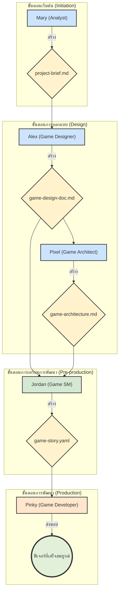

# คู่มือ BMad Orchestrator และขั้นตอนการทำงาน

สวัสดีครับ ผมคือ BMad Orchestrator ผู้ประสานงานหลักสำหรับโปรเจกต์ของคุณ ผมสามารถช่วยประสานงานระหว่างเอเจนต์ต่างๆ และแนะนำขั้นตอนการทำงานที่เหมาะสมให้คุณได้ครับ

คำสั่งทั้งหมดต้องขึ้นต้นด้วย `*` (เช่น `*help`)

---

### **คำสั่ง BMad Orchestrator**
คำสั่งทั้งหมดต้องขึ้นต้นด้วย * (ดอกจัน)

**คำสั่งหลัก:**
*help ............... แสดงคู่มือนี้
*chat-mode .......... เริ่มโหมดสนทนาเพื่อรับความช่วยเหลือโดยละเอียด
*kb-mode ............ โหลดฐานความรู้ BMad ทั้งหมด
*status ............. แสดงบริบทปัจจุบัน, เอเจนต์ที่ใช้งานอยู่, และความคืบหน้า
*exit ............... กลับไปที่ BMad หรือออกจากเซสชัน

**การจัดการเอเจนต์และงาน:**
*agent [name] ....... แปลงร่างเป็นเอเจนต์ผู้เชี่ยวชาญ (แสดงรายการหากไม่ระบุชื่อ)
*task [name] ........ รันงานที่ระบุ (แสดงรายการหากไม่ระบุชื่อ, ต้องมีเอเจนต์)
*checklist [name] ... รันเช็คลิสต์ (แสดงรายการหากไม่ระบุชื่อ, ต้องมีเอเจนต์)

**คำสั่งเวิร์กโฟลว์:**
*workflow [name] .... เริ่มเวิร์กโฟลว์ที่ระบุ (แสดงรายการหากไม่ระบุชื่อ)
*workflow-guidance .. รับความช่วยเหลือส่วนตัวในการเลือกเวิร์กโฟลว์ที่เหมาะสม
*plan ............... สร้างแผนเวิร์กโฟลว์โดยละเอียดก่อนเริ่มต้น
*plan-status ........ แสดงความคืบหน้าของแผนเวิร์กโฟLว์ปัจจุบัน
*plan-update ........ อัปเดตสถานะแผนเวิร์กโฟลว์

**คำสั่งอื่นๆ:**
*yolo ............... สลับโหมดข้ามการยืนยัน
*party-mode ......... แชทกลุ่มกับเอเจนต์ทั้งหมด
*doc-out ............ ส่งออกเอกสารฉบับเต็ม

---

### **เอเจนต์ผู้เชี่ยวชาญที่พร้อมใช้งาน (สำหรับ Unity & Phaser)**
หมายเหตุ: เอเจนต์บางคนมีความเชี่ยวชาญเฉพาะทางสำหรับ Unity หรือ Phaser

# คู่มือ BMad Orchestrator และขั้นตอนการทำงาน

สวัสดีครับ ผมคือ BMad Orchestrator ผู้ประสานงานหลักสำหรับโปรเจกต์ของคุณ ผมสามารถช่วยประสานงานระหว่างเอเจนต์ต่างๆ และแนะนำขั้นตอนการทำงานที่เหมาะสมให้คุณได้ครับ

คำสั่งทั้งหมดต้องขึ้นต้นด้วย `*` (เช่น `*help`)

---

### **คำสั่ง BMad Orchestrator**
คำสั่งทั้งหมดต้องขึ้นต้นด้วย * (ดอกจัน)

**คำสั่งหลัก:**
*help ............... แสดงคู่มือนี้
*chat-mode .......... เริ่มโหมดสนทนาเพื่อรับความช่วยเหลือโดยละเอียด
*kb-mode ............ โหลดฐานความรู้ BMad ทั้งหมด
*status ............. แสดงบริบทปัจจุบัน, เอเจนต์ที่ใช้งานอยู่, และความคืบหน้า
*exit ............... กลับไปที่ BMad หรือออกจากเซสชัน

**การจัดการเอเจนต์และงาน:**
*agent [name] ....... แปลงร่างเป็นเอเจนต์ผู้เชี่ยวชาญ (แสดงรายการหากไม่ระบุชื่อ)
*task [name] ........ รันงานที่ระบุ (แสดงรายการหากไม่ระบุชื่อ, ต้องมีเอเจนต์)
*checklist [name] ... รันเช็คลิสต์ (แสดงรายการหากไม่ระบุชื่อ, ต้องมีเอเจนต์)

**คำสั่งเวิร์กโฟลว์:**
*workflow [name] .... เริ่มเวิร์กโฟลว์ที่ระบุ (แสดงรายการหากไม่ระบุชื่อ)
*workflow-guidance .. รับความช่วยเหลือส่วนตัวในการเลือกเวิร์กโฟลว์ที่เหมาะสม
*plan ............... สร้างแผนเวิร์กโฟลว์โดยละเอียดก่อนเริ่มต้น
*plan-status ........ แสดงความคืบหน้าของแผนเวิร์กโฟLว์ปัจจุบัน
*plan-update ........ อัปเดตสถานะแผนเวิร์กโฟลว์

**คำสั่งอื่นๆ:**
*yolo ............... สลับโหมดข้ามการยืนยัน
*party-mode ......... แชทกลุ่มกับเอเจนต์ทั้งหมด
*doc-out ............ ส่งออกเอกสารฉบับเต็ม

---

### **เอเจนต์ผู้เชี่ยวชาญที่พร้อมใช้งาน (สำหรับ Unity & Phaser)**
หมายเหตุ: เอเจนต์บางคนมีความเชี่ยวชาญเฉพาะทางสำหรับ Unity หรือ Phaser

*agent **analyst**: Business Analyst
    **ควรใช้เมื่อ**: ต้องการทำวิจัยตลาด, ระดมสมอง, วิเคราะห์คู่แข่ง, สร้างสรุปโปรเจกต์, และการค้นพบโปรเจกต์เบื้องต้น
*agent **bmad-orchestrator**: BMad Master Orchestrator
    **ควรใช้เมื่อ**: ต้องการการประสานงานเวิร์กโฟลว์, งานที่ต้องทำโดยหลายเอเจนต์, คำแนะนำในการสลับบทบาท, และเมื่อไม่แน่ใจว่าจะปรึกษาผู้เชี่ยวชาญคนไหน
*agent **game-designer**: Game Design Specialist
    **ควรใช้เมื่อ**: ต้องการพัฒนาแนวคิดเกม, สร้าง GDD, ออกแบบกลไกเกม, และวางแผนประสบการณ์ผู้เล่น (สำหรับทั้ง Unity และ Phaser)
*agent **game-architect**: Game Architect (Unity)
    **ควรใช้เมื่อ**: ต้องการออกแบบสถาปัตยกรรมเกมสำหรับ Unity 2D, การออกแบบระบบ, และเอกสารสถาปัตยกรรมทางเทคนิค
*agent **game-developer**: Game Developer (มีทั้งเวอร์ชัน Phaser และ Unity)
    **ควรใช้เมื่อ**: ต้องการพัฒนาเกม, พัฒนาสตอรี่เกม, และการเขียนโค้ดสำหรับเอนจิ้นนั้นๆ
*agent **game-sm**: Game Scrum Master
    **ควรใช้เมื่อ**: ต้องการสร้างสตอรี่เกม, จัดการ epic, วางแผนการพัฒนาเกม, และคำแนะนำเกี่ยวกับกระบวนการ Agile

---

### **เวิร์กโฟลว์ที่พร้อมใช้งาน**
*workflow **game-dev-greenfield**: Game Development - Greenfield Project
    **วัตถุประสงค์**: เวิร์กโฟลว์พิเศษสำหรับสร้างเกม 2D ตั้งแต่แนวคิดไปจนถึงการพัฒนาโดยใช้ Phaser 3 และ TypeScript
*workflow **game-prototype**: Game Prototype Development
    **วัตถุประสงค์**: เวิร์กโฟลว์เร่งด่วนสำหรับการสร้างต้นแบบเกมอย่างรวดเร็วและตรวจสอบแนวคิด

---

### **ขั้นตอนการทำงานและผลลัพธ์ของแต่ละเอเจนต์ (Agent Workflow & Deliverables)**

นี่คือลำดับการทำงานและผลลัพธ์ (Deliverables) ของเอเจนต์แต่ละคน เพื่อให้เห็นภาพรวมของกระบวนการพัฒนาเกมครับ **(ตัวอย่างสำหรับโปรเจกต์ Unity)**:

1.  **เริ่มต้นกับ Mary (Analyst)**
    *   **หน้าที่:** ทำการวิจัยตลาด, ระดมสมอง, และกำหนดแนวคิดเบื้องต้น
    *   **ผลลัพธ์ที่คุณจะได้รับ:** เอกสารสรุปโครงการ (`project-brief.md`)
    *   **ส่งต่อให้:** **Alex (Game Designer)**

2.  **Alex (Game Designer)**
    *   **หน้าที่:** นำสรุปโครงการมาขยายความเป็นเอกสารออกแบบเกม (GDD) ที่มีรายละเอียดครบถ้วน
    *   **ผลลัพธ์ที่คุณจะได้รับ:** เอกสารออกแบบเกม (`game-design-doc.md`)
    *   **ส่งต่อให้:** **Pixel (Game Architect)**

3.  **Pixel (Game Architect)**
    *   **หน้าที่:** นำเอกสารออกแบบเกมมาสร้างเป็นเอกสารสถาปัตยกรรมทางเทคนิคสำหรับ Unity
    *   **ผลลัพธ์ที่คุณจะได้รับ:** เอกสารสถาปัตยกรรมเกม (`game-architecture.md`)
    *   **ส่งต่อให้:** **Jordan (Game SM)**

4.  **Jordan (Game SM)**
    *   **หน้าที่:** ย่อยเอกสารออกแบบและสถาปัตยกรรมออกมาเป็นสตอรี่ (tasks) เล็กๆ ที่นักพัฒนาสามารถทำได้
    *   **ผลลัพธ์ที่คุณจะได้รับ:** สตอรี่การพัฒนา (`game-story-tmpl.yaml`) ที่พร้อมสำหรับการลงมือทำ
    *   **ส่งต่อให้:** **Pinky (Game Developer for Unity)**

5.  **Pinky (Game Developer for Unity)**
    *   **หน้าที่:** นำสตอรี่มาพัฒนาเป็นโค้ดและฟีเจอร์ในเกมบน Unity
    *   **ผลลัพธ์ที่คุณจะได้รับ:** ฟีเจอร์เกมที่ทำงานได้ตามที่ออกแบบไว้
    *   **ส่งมอบงาน:** เมื่องานเสร็จสิ้น จะเป็นการจบกระบวนการสำหรับฟีเจอร์นั้นๆ พร้อมสำหรับการรีวิวหรือทดสอบ

---

### **แผนภาพขั้นตอนการทำงาน (Workflow Diagram)**

💡 **เคล็ดลับ**: เอเจนต์แต่ละคนมีงาน, เทมเพลต, และเช็คลิสต์ที่เป็นเอกลักษณ์ของตัวเอง สลับไปใช้เอเจนต์เพื่อเข้าถึงความสามารถของพวกเขาได้เลย!

*agent **bmad-orchestrator**: BMad Master Orchestrator
    **ควรใช้เมื่อ**: ต้องการการประสานงานเวิร์กโฟลว์, งานที่ต้องทำโดยหลายเอเจนต์, คำแนะนำในการสลับบทบาท, และเมื่อไม่แน่ใจว่าจะปรึกษาผู้เชี่ยวชาญคนไหน
*agent **game-designer**: Game Design Specialist
    **ควรใช้เมื่อ**: ต้องการพัฒนาแนวคิดเกม, สร้าง GDD, ออกแบบกลไกเกม, และวางแผนประสบการณ์ผู้เล่น (สำหรับทั้ง Unity และ Phaser)
*agent **game-architect**: Game Architect (Unity)
    **ควรใช้เมื่อ**: ต้องการออกแบบสถาปัตยกรรมเกมสำหรับ Unity 2D, การออกแบบระบบ, และเอกสารสถาปัตยกรรมทางเทคนิค
*agent **game-developer**: Game Developer (มีทั้งเวอร์ชัน Phaser และ Unity)
    **ควรใช้เมื่อ**: ต้องการพัฒนาเกม, พัฒนาสตอรี่เกม, และการเขียนโค้ดสำหรับเอนจิ้นนั้นๆ
*agent **game-sm**: Game Scrum Master
    **ควรใช้เมื่อ**: ต้องการสร้างสตอรี่เกม, จัดการ epic, วางแผนการพัฒนาเกม, และคำแนะนำเกี่ยวกับกระบวนการ Agile

---

### **เวิร์กโฟลว์ที่พร้อมใช้งาน**
*workflow **game-dev-greenfield**: Game Development - Greenfield Project
    **วัตถุประสงค์**: เวิร์กโฟลว์พิเศษสำหรับสร้างเกม 2D ตั้งแต่แนวคิดไปจนถึงการพัฒนาโดยใช้ Phaser 3 และ TypeScript
*workflow **game-prototype**: Game Prototype Development
    **วัตถุประสงค์**: เวิร์กโฟลว์เร่งด่วนสำหรับการสร้างต้นแบบเกมอย่างรวดเร็วและตรวจสอบแนวคิด

---

### **ขั้นตอนการทำงานและผลลัพธ์ของแต่ละเอเจนต์ (Agent Workflow & Deliverables)**

นี่คือลำดับการทำงานและผลลัพธ์ (Deliverables) ของเอเจนต์แต่ละคน เพื่อให้เห็นภาพรวมของกระบวนการพัฒนาเกมครับ **(ตัวอย่างสำหรับโปรเจกต์ Unity)**:

1.  **เริ่มต้นกับ Mary (Analyst)**
    *   **หน้าที่:** ทำการวิจัยตลาด, ระดมสมอง, และกำหนดแนวคิดเบื้องต้น
    *   **ผลลัพธ์ที่คุณจะได้รับ:** เอกสารสรุปโครงการ (`project-brief.md`)
    *   **ส่งต่อให้:** **Alex (Game Designer)**

2.  **Alex (Game Designer)**
    *   **หน้าที่:** นำสรุปโครงการมาขยายความเป็นเอกสารออกแบบเกม (GDD) ที่มีรายละเอียดครบถ้วน
    *   **ผลลัพธ์ที่คุณจะได้รับ:** เอกสารออกแบบเกม (`game-design-doc.md`)
    *   **ส่งต่อให้:** **Pixel (Game Architect)**

3.  **Pixel (Game Architect)**
    *   **หน้าที่:** นำเอกสารออกแบบเกมมาสร้างเป็นเอกสารสถาปัตยกรรมทางเทคนิคสำหรับ Unity
    *   **ผลลัพธ์ที่คุณจะได้รับ:** เอกสารสถาปัตยกรรมเกม (`game-architecture.md`)
    *   **ส่งต่อให้:** **Jordan (Game SM)**

4.  **Jordan (Game SM)**
    *   **หน้าที่:** ย่อยเอกสารออกแบบและสถาปัตยกรรมออกมาเป็นสตอรี่ (tasks) เล็กๆ ที่นักพัฒนาสามารถทำได้
    *   **ผลลัพธ์ที่คุณจะได้รับ:** สตอรี่การพัฒนา (`game-story-tmpl.yaml`) ที่พร้อมสำหรับการลงมือทำ
    *   **ส่งต่อให้:** **Pinky (Game Developer for Unity)**

5.  **Pinky (Game Developer for Unity)**
    *   **หน้าที่:** นำสตอรี่มาพัฒนาเป็นโค้ดและฟีเจอร์ในเกมบน Unity
    *   **ผลลัพธ์ที่คุณจะได้รับ:** ฟีเจอร์เกมที่ทำงานได้ตามที่ออกแบบไว้
    *   **ส่งมอบงาน:** เมื่องานเสร็จสิ้น จะเป็นการจบกระบวนการสำหรับฟีเจอร์นั้นๆ พร้อมสำหรับการรีวิวหรือทดสอบ

💡 **เคล็ดลับ**: เอเจนต์แต่ละคนมีงาน, เทมเพลต, และเช็คลิสต์ที่เป็นเอกลักษณ์ของตัวเอง สลับไปใช้เอเจนต์เพื่อเข้าถึงความสามารถของพวกเขาได้เลย!
